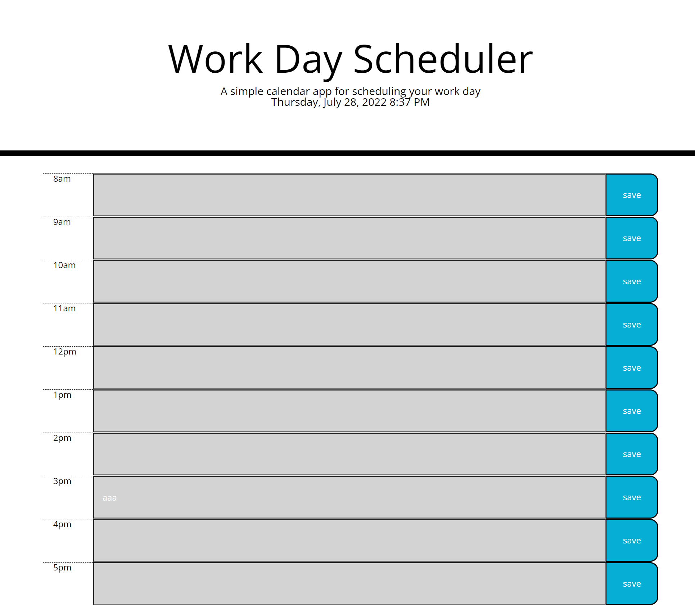

# Mod-05-Scheduler-Ansari

This contains the Module 5 Challenge
## Description
- This project was to create an event scheduler
- The goal was to create a color coded scheduler that would tell us what times are in the past present and future.
- Furthermore it would allow us to save our inputs, so on refresh they would still apear
- Working on this project showed the importance of keeping my code organized. Creating all of the functions, planning out what elements of the DOC would be used etc.
## Usage

- to use this site simply click on the field where you wish to make and appointment
- enter the appointment details and then press save
- the saved values should show up again on refresh

## Screenshot

## Link

